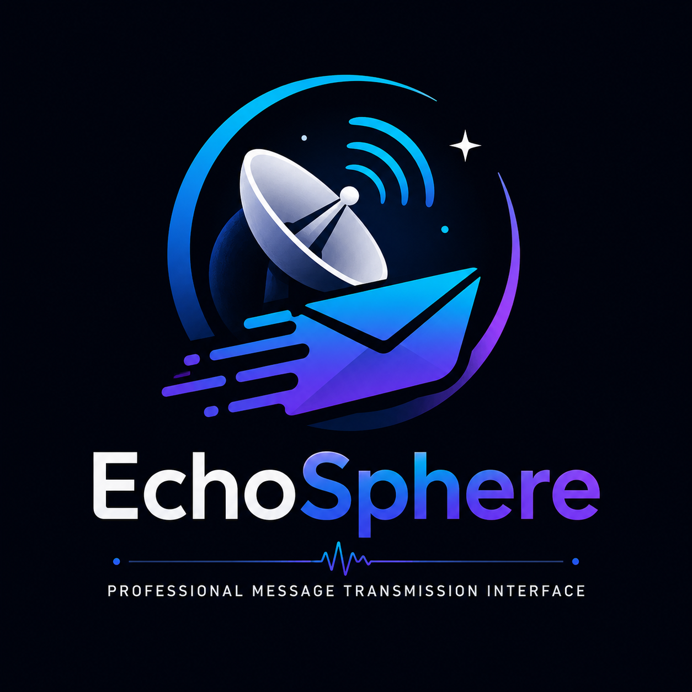

# 🛰️ EchoSphere

<p align="center">
  
</p>

<h1 align="center">EchoSphere</h1>

<p align="center">
Professional Message Transmission Interface built with Streamlit.
</p>

<p align="center">


</p>

---

# ✨ Overview

EchoSphere is a modern Streamlit application that simulates a professional
message transmission system.

Unlike a basic form submission project, EchoSphere provides a polished user
experience inspired by modern SaaS dashboards while demonstrating clean
software architecture, reusable UI components, validation pipelines,
token estimation, persistent history, and modular code organization.

The application was designed to showcase both Python programming skills and
professional frontend development using Streamlit.

---

# 🚀 Key Features

## Modern User Interface

- Modern SaaS Dashboard
- Dark Glassmorphism Theme
- Responsive Layout
- Compact Single-Viewport Design
- Sidebar Dashboard
- Live Preview
- Professional Cards
- Gradient Buttons
- Smooth Animations

---

## Message Transmission

✔ Name Input

✔ Message Input

✔ Real-Time Preview

✔ Single Click Transmission

✔ Duplicate Submission Protection

✔ Persistent History

---

## Validation Engine

The application performs multiple validation checks before processing.

- Empty Name Detection
- Empty Message Detection
- Maximum Length Validation
- Friendly Error Messages
- Warning System
- Success Confirmation

---

## System Diagnostics

Every successful transmission generates a complete diagnostic report.

Displays

- Character Count
- Word Count
- Estimated AI Tokens
- Reading Time
- Context Window Usage
- Progress Indicator

---

## Advanced AI Feature

EchoSphere estimates Large Language Model token usage using the common rule:

```
1 Token ≈ 4 Characters
```

This simulates how OpenAI, Gemini and Claude estimate prompt costs.

---

# 🏗 Project Architecture

```
EchoSphere
│
├── app.py
│
├── assets
│   └── styles.css
│
├── core
│   ├── formatter.py
│   ├── metrics.py
│   ├── processor.py
│   ├── tokenizer.py
│   └── validator.py
│
├── ui
│   ├── alerts.py
│   ├── cards.py
│   ├── footer.py
│   ├── header.py
│   ├── preview.py
│   └── sidebar.py
│
├── utils
│   ├── constants.py
│   ├── helpers.py
│   └── theme.py
│
├── data
│   ├── config.json
│   └── history.json
│
├── tests
│   ├── test_processor.py
│   ├── test_tokenizer.py
│   └── test_validator.py
│
├── docs
│
├── requirements.txt
├── README.md
├── LICENSE
└── .gitignore
```

---

# 📐 Software Architecture

```
                User

                  │

                  ▼

            Streamlit UI

                  │

         ┌────────┴────────┐

         ▼                 ▼

     UI Components      Theme Engine

         │

         ▼

    Business Logic

         │

 ┌───────┼─────────┐

 ▼       ▼         ▼

Validator Tokenizer Processor

         │

         ▼

      Formatter

         │

         ▼

 JSON Storage (History)
```

---

# 🛠 Technologies Used

| Technology | Purpose |
|------------|----------|
| Python | Core Language |
| Streamlit | Web Interface |
| JSON | Persistent Storage |
| PyTest | Testing |
| CSS | Custom Styling |

---

# 📂 Folder Structure

(Keep your tree here.)

---

# ⚙ Installation

Clone the repository

```bash
git clone https://github.com/Arijitsen-ece/EchoSphere.git
```

Move into the project

```bash
cd EchoSphere
```

Create Virtual Environment

```bash
python -m venv venv
```

Activate

Windows

```bash
venv\Scripts\activate
```

Linux / Mac

```bash
source venv/bin/activate
```

Install dependencies

```bash
pip install -r requirements.txt
```

---

# ▶ Run Application

```bash
streamlit run app.py
```

Application starts at

```
http://localhost:8501
```

---

# 🧪 Running Tests

Run all unit tests

```bash
pytest tests -v
```

---

# 📸 Screenshots

## Home

```
docs/screenshots/home.png
```

---

## Successful Transmission

```
docs/screenshots/success.png
```

---

## System Check

```
docs/screenshots/system-check.png
```

---

## Sidebar

```
docs/screenshots/sidebar.png
```

---

# 📊 Features Demonstrated

✅ Modular Architecture

✅ Component Based UI

✅ Clean Code Principles

✅ Python OOP

✅ Session State

✅ Input Validation

✅ Token Estimation

✅ Progress Indicators

✅ Persistent Storage

✅ Responsive Design

✅ Unit Testing

---

# 🚀 Future Improvements

- User Authentication

- Database Support

- Export PDF Reports

- Export CSV

- Real AI Tokenizer (tiktoken)

- Dark / Light Theme Switch

- Docker Deployment

- GitHub Actions CI/CD

- Streamlit Cloud Deployment

- REST API Integration

---

# 🤝 Contributing

Contributions are welcome.

1. Fork the repository

2. Create a feature branch

3. Commit your changes

4. Push your branch

5. Open a Pull Request

---

# 📄 License

Licensed under the MIT License.

See the LICENSE file for details.

---

# 👨‍💻 Developer

**Arijit Sen**

Electronics & Communication Engineering

JIS College of Engineering

GitHub

https://github.com/Arijitsen-ece

---

<p align="center">

Made with ❤️ using Python and Streamlit

</p>